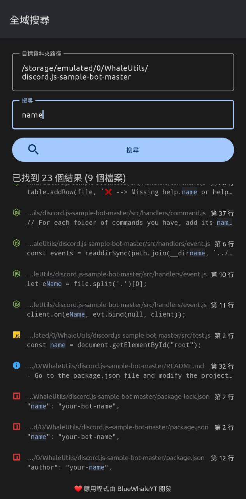

# Global Search 全域搜尋

Global Search is an open source project, and a simple Android application providing a function of searching keywords from the files globally.

## Screenshots

## How to use this app? 

You can download the debug version from [Actions](https://github.com/BlueWhaleYT/GlobalSearch/actions).

There are two inputs:

1. Root directory path: is the target directory you want to start searching from.
2. Search: the keyword text to be searched.

## How this app inspires you?

You can append this feature to your text editor android project because this feature is awesome and helpful.
